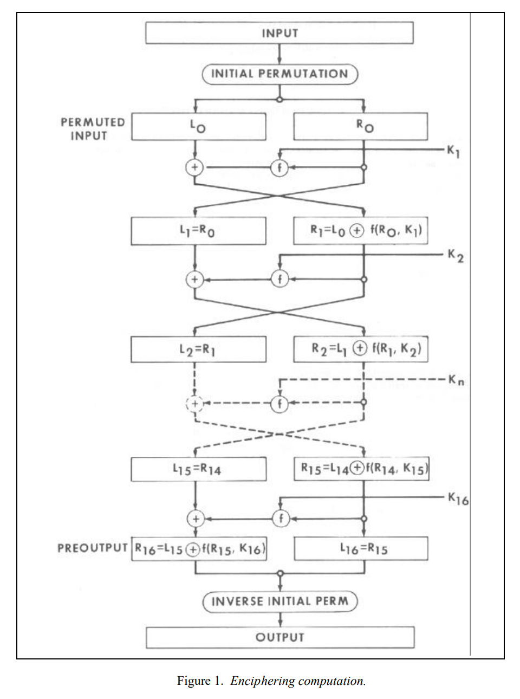
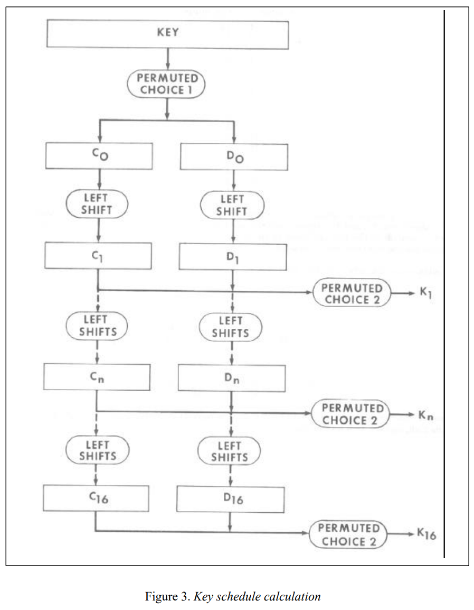

# Implementing DES In Python
For this project I wrote a basic implementation of the DES Block Cipher. It encrypts and decrypts 64 bit blocks (in binary or hex) using 64 bit keys (technically only 56 bits are needed, but the specification includes parity bits that are meant to be dropped, so I stuck with the 64 bit keys.)

---
## Overview of The Encryption   


&nbsp;&nbsp;&nbsp;&nbsp;&nbsp;&nbsp;&nbsp;&nbsp;Despite the name DES is not longer the Data Encryption Standard as it was replaced by AES, but it is still an interesting Block Cipher to implement. It was created in the early 1970s by IBM in conjuction with the NSA. The cipher accepts only 64 bit datablocks and 64 bit keys. However, because 8 of those bits are designated for parity, the effective key length is 56, which makes DES susceptible to bruteforce attacks. The algorithm DES uses for encryption is fairly simple to understand, but a lot of thought went into its design (the officaly FIPS standard is in the repo). 

&nbsp;&nbsp;&nbsp;&nbsp;&nbsp;&nbsp;&nbsp;&nbsp;The encryption starts with by sending the message through an initial permutation defined in the standard. This type of thing is done quite a few times throughout the encryption and comes from the fact DES was designed with a hardware implementation in mind, and permutations are extremely easy to do with wires (just cross them). After this the input is split into two 32 bit blocks and the Rounds begin. DES is split into 16 Rounds where the subkey from the keyschedule (see below) is mixed into the right side of the input through the F function, then xor'ed into the left side to be stored as the next right side for the next round (it is crossed). The right side then goes to the left side untouched to become the new left side for the next round. This is what allows the structure to be invertable, and what makes it a Feistel Network. After the last round there is a final permutation which is the direct inverse of the initial permutation.

---

### *DES Encryption Function*
This is the main function that outlines the overall structure of the DES Feistel Network. It starts by checking to see if the message and key are 64 bits (or 16 bit hex which it converts to 64 bit binary strings). Then permutes the message, loops through the Round function on two halves 16 times while swapping the sides (except for the last time). Finally the inverse of the inital permutation is applied to get the encrypted cyphertext. Next we will go into detail on the Round function.


```python
def encrypt(message, key):

    message, key = check_data_and_key(message, key)
    key_schedule = generate_keys(key)

    print('Data Being Encrypted: ', bin_to_hex(message, 64))
    perm = IP(message)
    print('After Initial Permutation: ', bin_to_hex(perm, 64))
    left_half, right_half = perm[0:32], perm[32:64]
    
    print(' ' * 10, 'Left Half  ', 'Right Half ', 'Sub Key  ')
    for loop in range(16):
        left_half, right_half = round(left_half, right_half, key_schedule[loop])
        if loop == 15: # The algorithm doesn't swap the last pair
            buffer = left_half
            left_half = right_half
            right_half = buffer
        print('Round: ', loop + 1, ' ', bin_to_hex(left_half, 32), ' ',
                bin_to_hex(right_half, 32), ' ', bin_to_hex(key_schedule[loop], 48))
    cyphertext = IP_Inverse(left_half + right_half)
    return cyphertext
```

---

#### *DES Round Function*
This is the core of the Feistel Network that makes up DES. It is called 16 times, it takes the right half of the block and runs it through the Feistel Function (see next section) the output is then xor'ed with the left half and this becomes the new right half for the next round. Then the old right half is outputted directly as the new left half (making the round function invertible)

```python
def round(left_half, right_half, key):
    new_left_half = xor(left_half, f(right_half, key))
    return (right_half, new_left_half)
```
---

#### *DES Feistel Function*
Here is where the majority of the computation of DES is done. The Feistel Function has four stages. First it goes through an expansion permutation. the 32 bit input is permuted into a 48 bit string. The next stage is key mixing where the 48 bit key is xor'ed into the now 48 bit message half. The third and most important stage is the substitution box stage. This is very important so its covered in its own section; note that the message is back down to 32 bits after this stage though. Lastly, there is another permutation using a preset permutation table.
```python
def f(bytes, key):
    expanded = f_expansion(bytes)
    mixed = f_key_mixing(expanded, key)
    substituted = s_boxes(mixed)
    permutation = f_permute(substituted)
    return permutation
```
---

#### *DES Substitution Boxes*
These substitution boxes are really the core of the DES algorithm, first the 48 bit input is split up into six bit chunks and then these chunks are mapped to 4 output bits using the substitution boxes defined by the DES standard (the specific values of the s-boxes were chosen to strengthen the cipher from differential cryptanalysis). This is done by splitting those substrings into the outer and inner bits (so a group of two and a group of four), and then using the decimal value of those binary numbers as indexes for the lookup in the s-boxes, convert these integers from the s-boxes back to binary, pad zeros if necessary, and then the bit string is outputted to the next stage. These s-boxes provide the diffusion necessary to make a secure block cipher (not that DES is secure, because it is vulnerable to bruteforce). 
```python
def s_boxes(bits):
    sboxes =   [[[14, 4, 13, 1, 2, 15, 11, 8, 3, 10, 6, 12, 5, 9, 0, 7], [0, 15, 7, 4, 14, 2, 13, 1, 10, 6, 12, 11, 9, 5, 3, 8], [4, 1, 14, 8, 13, 6, 2, 11, 15, 12, 9, 7, 3, 10, 5, 0], [15, 12, 8, 2, 4, 9, 1, 7, 5, 11, 3, 14, 10, 0, 6, 13 ]],       
                [[15, 1, 8, 14, 6, 11, 3, 4, 9, 7, 2, 13, 12, 0, 5, 10], [3, 13, 4, 7, 15, 2, 8, 14, 12, 0, 1, 10, 6, 9, 11, 5], [0, 14, 7, 11, 10, 4, 13, 1, 5, 8, 12, 6, 9, 3, 2, 15], [13, 8, 10, 1, 3, 15, 4, 2, 11, 6, 7, 12, 0, 5, 14, 9 ]],
                [[10, 0, 9, 14, 6, 3, 15, 5, 1, 13, 12, 7, 11, 4, 2, 8], [13, 7, 0, 9, 3, 4, 6, 10, 2, 8, 5, 14, 12, 11, 15, 1], [13, 6, 4, 9, 8, 15, 3, 0, 11, 1, 2, 12, 5, 10, 14, 7], [1, 10, 13, 0, 6, 9, 8, 7, 4, 15, 14, 3, 11, 5, 2, 12 ]],
                [[7, 13, 14, 3, 0, 6, 9, 10, 1, 2, 8, 5, 11, 12, 4, 15], [13, 8, 11, 5, 6, 15, 0, 3, 4, 7, 2, 12, 1, 10, 14, 9], [10, 6, 9, 0, 12, 11, 7, 13, 15, 1, 3, 14, 5, 2, 8, 4], [3, 15, 0, 6, 10, 1, 13, 8, 9, 4, 5, 11, 12, 7, 2, 14 ]],
                [[2, 12, 4, 1, 7, 10, 11, 6, 8, 5, 3, 15, 13, 0, 14, 9], [14, 11, 2, 12, 4, 7, 13, 1, 5, 0, 15, 10, 3, 9, 8, 6], [4, 2, 1, 11, 10, 13, 7, 8, 15, 9, 12, 5, 6, 3, 0, 14], [11, 8, 12, 7, 1, 14, 2, 13, 6, 15, 0, 9, 10, 4, 5, 3 ]],
                [[12, 1, 10, 15, 9, 2, 6, 8, 0, 13, 3, 4, 14, 7, 5, 11], [10, 15, 4, 2, 7, 12, 9, 5, 6, 1, 13, 14, 0, 11, 3, 8], [9, 14, 15, 5, 2, 8, 12, 3, 7, 0, 4, 10, 1, 13, 11, 6], [4, 3, 2, 12, 9, 5, 15, 10, 11, 14, 1, 7, 6, 0, 8, 13 ]],
                [[4, 11, 2, 14, 15, 0, 8, 13, 3, 12, 9, 7, 5, 10, 6, 1], [13, 0, 11, 7, 4, 9, 1, 10, 14, 3, 5, 12, 2, 15, 8, 6], [1, 4, 11, 13, 12, 3, 7, 14, 10, 15, 6, 8, 0, 5, 9, 2], [6, 11, 13, 8, 1, 4, 10, 7, 9, 5, 0, 15, 14, 2, 3, 12 ]],
                [[13, 2, 8, 4, 6, 15, 11, 1, 10, 9, 3, 14, 5, 0, 12, 7], [1, 15, 13, 8, 10, 3, 7, 4, 12, 5, 6, 11, 0, 14, 9, 2], [7, 11, 4, 1, 9, 12, 14, 2, 0, 6, 10, 13, 15, 3, 5, 8], [2, 1, 14, 7, 4, 10, 8, 13, 15, 12, 9, 0, 3, 5, 6, 11 ]]]
    # Split the bytes into 8 substrings, split those substrings into the outer and inner bits, 
    #       and use them as indexes for the lookup in the sboxes, convert to binary and pad zeros if necessary
    substituted_string = ''
    for i in range(0,48,6):
        substring = (bits[0:48][i:i+6])
        row = bin_to_int(substring[0] + substring[5])
        column = bin_to_int(substring[1] + substring[2] + substring[3] + substring[4])
        lookup = int_to_bin(sboxes[int(i/6)][row][column])
        if len(lookup) < 4:
            lookup = ((4 - len(lookup)) * '0') + lookup
        substituted_string += lookup
    return substituted_string
```

### *DES Decryption*
The decryption of DES is virtually identical to the encryption. The only difference in the code of the two functions is that the key_schedule is read in reverse. This is an inherent property of the Feistel Network; They are invertible. This is doubly important when taking into consideration the fact that DES was created with a hardware implementation in mind, as it means that the amount of circuitry required is cut in half.

Here is the only line that is changed, the key schedule is read in reverse ('loop' is the value holding the number of the Round you are on):
```python
left_half, right_half = round(left_half, right_half, key_schedule[15 - loop])
```
---

### **Key Schedule**


&nbsp;&nbsp;&nbsp;&nbsp;&nbsp;&nbsp;&nbsp;&nbsp;Lastly, we have to talk about how DES handles its key generation. DES uses a 64 bit key but the first stage of generating the key schedule involves dropping off 8 bits which are set aside for parity checks (according to the standard, the sections of the key should all have odd parity). This means, however, that the effective key of DES is only 56 bits. Someone trying to break the cipher would only need to bruteforce those 56 bits which makes the cipher vulnerable to this method of attack. Anyway, the parity bits are dropped during an inital permutation that the key goes through labeled PC_1. 


&nbsp;&nbsp;&nbsp;&nbsp;&nbsp;&nbsp;&nbsp;&nbsp;Then begins the process of generating the 16 subkeys that makeup the key schedule. First the initial_key is split into two 28 bit halves. Then the bitstrings that makeup those halves are sent through 16 Rounds to generate the 16 subkeys. In each Round they are left rotated by 1 bit for Rounds 1,2,8, and 16, and 2 bits for the rest of the Rounds. After each rotation, the halves are combined again and ran through a compressing permutation PC_2 which gets it down to the 48 bits we need for the subkeys. This is then saved into the key_schedule, and the whole thing is done 16 times. The left and right sides are NOT swapped like they are during the actual encryption of DES. But the bitshifts are carried through each round, not temporary. The Decryption algorithm uses the exact same key generation function, the list is just read in reverse when applying the DES Round function to the message.


```python
def generate_keys(intitial_state):

    if len(intitial_state) != 64:
        if len(intitial_state) == 16:
            intitial_state = hex_to_binary(intitial_state, 16)
        else:
            return 'ERROR MESSAGE NOT PROPER SIZE'

    pc_1 = [57, 49, 41, 33, 25, 17, 9, 1, 58, 50, 42, 34, 26, 18, 10, 2, 59, 51, 43, 35, 27, 19, 11, 3, 60, 52, 44, 36, 
            63, 55, 47, 39, 31, 23, 15, 7, 62, 54, 46, 38, 30, 22, 14, 6, 61, 53, 45, 37, 29, 21, 13, 5, 28, 20, 12, 4]
    pc_2 = [14, 17, 11, 24, 1, 5, 3, 28, 15, 6, 21, 10, 23, 19, 12, 4, 26, 8, 16, 7, 27, 20, 13, 2, 41, 
            52, 31, 37, 47, 55, 30, 40, 51, 45, 33, 48, 44, 49, 39, 56, 34, 53, 46, 42, 50, 36, 29, 32 ]
    permuted = permute(intitial_state, pc_1, 56)
    
    key_schedule = []
    left_half, right_half = permuted[0:28], permuted[28:56]
    for loop in range(16):
        if {0,1,8,15}.__contains__(loop):
            left_half, right_half = shifted(left_half, 1), shifted(right_half, 1)
        else:
            left_half, right_half = shifted(left_half, 2), shifted(right_half, 2)
        key_schedule.append(permute((left_half + right_half), pc_2, 48))
    return key_schedule
```
---

### Testing The Function:
Here is some test code, it encrypts a 64 bit binary string with a 64 bit hex string, then decrypts it and prints the result:
```python
test = '1011101011101010111011111011100011101011111000101011101011101011'   
key = '908F6CA04B08D401'

cyphertext = encrypt(test, key)
print('Encrypted Result: ', len(cyphertext))
print('Decrypted Result: ', bin_to_hex(decrypt(cyphertext, key), 64))
```
This is the output:
```console
Data Being Encrypted:  BAEAEFB8EBE2BAEB             -   Data Being Decrypted:       25EAB828A3FFA98B
After Initial Permutation:  B6490494FFFFDFF7        -   After Initial Permutation:  222421F1F67FEEB2
           Left Half   Right Half  Sub Key          -              Left Half   Right Half  Sub Key
Round:  1   FFFFDFF7   881A2A5E   286116BC04B8      -   Round:  1   F67FEEB2   C6949812   286116BC04B8
Round:  2   881A2A5E   3C8269B6   175644837424      -   Round:  2   C6949812   5126B564   175644837424
Round:  3   3C8269B6   83C9D38A   4A51C0680BA0      -   Round:  3   5126B564   035B75AB   4A51C0680BA0
Round:  4   83C9D38A   5531D493   18C16D90481F      -   Round:  4   035B75AB   98E503C7   18C16D90481F
Round:  5   5531D493   D8740974   81410B471290      -   Round:  5   98E503C7   64B1861B   81410B471290
Round:  6   D8740974   48245FBB   210BA5912169      -   Round:  6   64B1861B   C489C856   210BA5912169
Round:  7   48245FBB   FDAEDCCE   913881229A04      -   Round:  7   C489C856   A0268BF8   913881229A04
Round:  8   FDAEDCCE   A0268BF8   1126F05025B6      -   Round:  8   A0268BF8   FDAEDCCE   1126F05025B6
Round:  9   A0268BF8   C489C856   20E81C84F105      -   Round:  9   FDAEDCCE   48245FBB   20E81C84F105
Round:  10   C489C856   64B1861B   042D222226E0     -   Round:  10   48245FBB   D8740974   042D222226E0
Round:  11   64B1861B   98E503C7   E22C31F88903     -   Round:  11   D8740974   5531D493   E22C31F88903
Round:  12   98E503C7   035B75AB   CDA60006461A     -   Round:  12   5531D493   83C9D38A   CDA60006461A
Round:  13   035B75AB   5126B564   42969A5D3140     -   Round:  13   83C9D38A   3C8269B6   42969A5D3140
Round:  14   5126B564   C6949812   7C9042A0C068     -   Round:  14   3C8269B6   881A2A5E   7C9042A0C068
Round:  15   C6949812   F67FEEB2   22C84A40BE06     -   Round:  15   881A2A5E   FFFFDFF7   22C84A40BE06
Round:  16   222421F1   F67FEEB2   8432D1089119     -   Round:  16   B6490494   FFFFDFF7   8432D1089119
Encrypted Result:  25EAB828A3FFA98B                 -   Decrypted Result:  BAEAEFB8EBE2BAEB

```
There are several things to note from the output of the function. If you look at the decryption rounds, they correspond to the upside down rows of the encryption rounds.
The key schedule is also upside down. 

Another important part of DES is that if I change the ***test*** variable by a single bit, the output will radically change. After changing one bit this is what I get for the cyphertext: D81E2D967868060F. Which is very different from the previous 25EAB828A3FFA98B value. This is extremely important to the security of the cipher. 

---
### Final Thoughts
DES is conceptually very interesting; it is **the** prototypical block cipher. Implementing it in Python helped to cement the invertiability of the Feistel Structure, and the non-linear transformation that happens when the bits go through the s-boxes. While DES might not be offically secure any longer, it is still incredibly important to the history of cryptography and the basis of the majority of block ciphers. 
